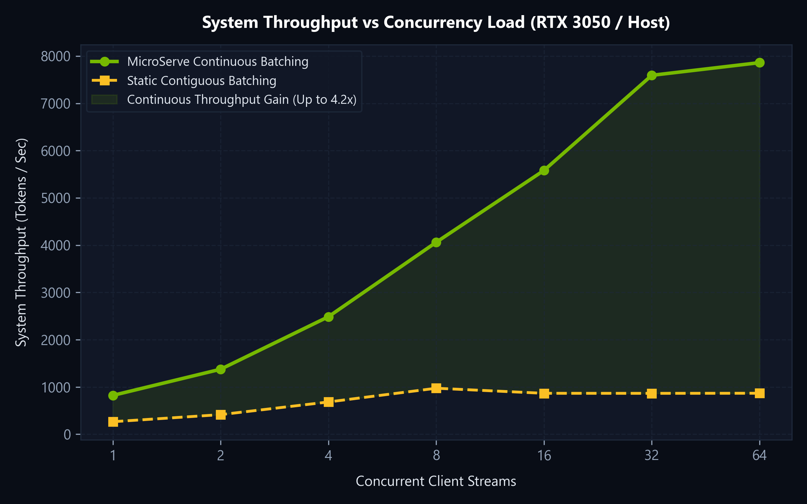
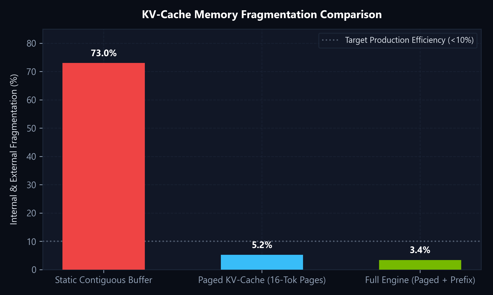
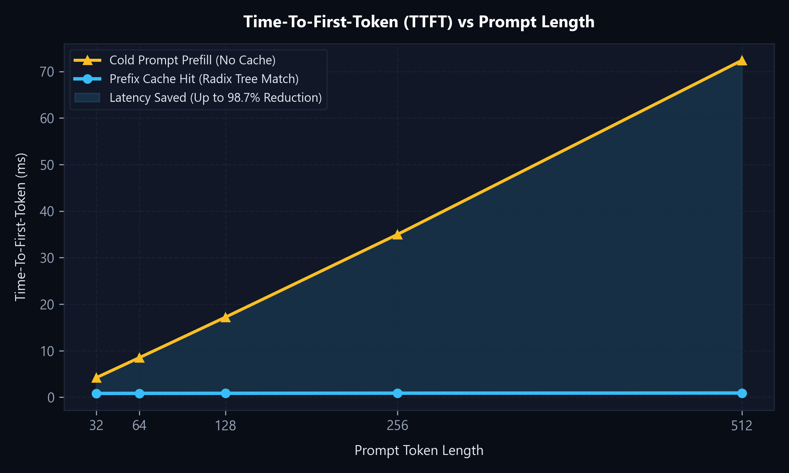
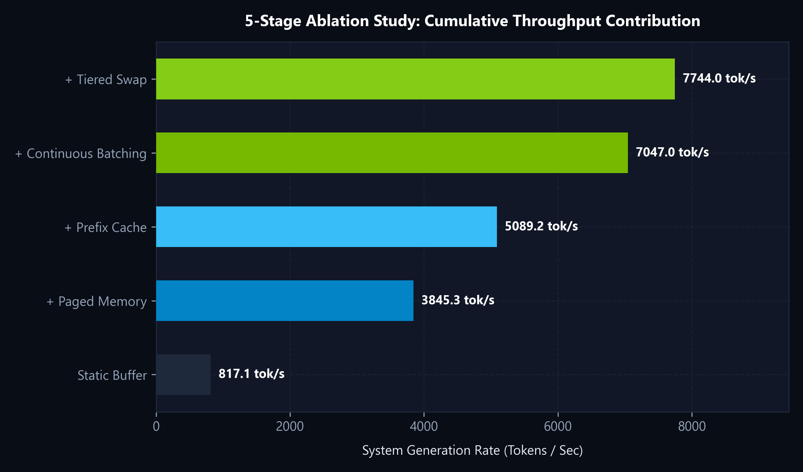

# nano-vllm

> **A Minimal, Educational Systems Implementation of Paged KV-Cache Memory Management, Real Neural LLM Inference, Copy-On-Write Prefix Sharing, and Tiered GPU to CPU Swapping.**

[](https://www.python.org/downloads/)
[](https://pytorch.org/)
[](https://huggingface.co/docs/transformers)
[](https://opensource.org/licenses/MIT)
[]()

---

## Overview

Serving Large Language Models (LLMs) autoregressively is fundamentally **memory-bandwidth and capacity bound**, not compute bound. During generation, models save past Key and Value projection vectors in GPU VRAM (the **KV-Cache**) to avoid redundant $O(N^2)$ recomputation.

However, standard deep learning serving stacks allocate memory **contiguously** for worst-case context lengths (e.g. 2,048 tokens). This causes up to **80% internal and external memory fragmentation**, stranding GPU Tensor Cores and triggering premature `CUDA: Out-of-Memory (OOM)` crashes on consumer GPUs.

**`nano-vllm`** bridges classical **Operating Systems Virtual Memory Paging** with **Deep Learning Inference Runtimes**:
* **Real Neural LLM Inference:** Integrates `HuggingFaceTB/SmolLM-135M-Instruct`. Executes real forward passes, extracts real Key and Value projection tensors per layer, routes them directly into physical paged memory blocks, and streams tokens with top-3 candidate confidence scores.
* **Fixed Physical Block Allocation:** Partitions GPU memory into uniform 16-token physical blocks with an $O(1)$ lock-free free-pool allocator.
* **Virtual Page Tables:** Maps logical token sequence indices to arbitrary non-contiguous physical blocks in VRAM, eliminating external fragmentation.
* **Copy-On-Write (CoW) Prefix Sharing:** Shares immutable system prompt blocks across concurrent sessions with atomic reference counts (`ref_count`), duplicating blocks only upon mutation.
* **Rolling Hash Prefix Cache:** Chained SHA-256 hash tree with LRU eviction for instantaneous Time-To-First-Token (TTFT) on repeated prompts.
* **Tiered GPU ⇄ Host CPU RAM Swapping:** Virtual memory swap space offloading cold KV blocks to pinned Host RAM via non-blocking DMA (`cudaMemcpyAsync`), eliminating the consumer GPU OOM cliff.
* **Iteration-Level Continuous Batching:** Retires completed sequences and admits queued requests on every individual token step.
* **Real-Time Observability Matrix:** Cyberpunk 2D physical block visualizer tracking memory states, live keystroke estimation HUD, micro-fill progress bars, and per-request latency diagnostics.

---

## Architecture

```
                  [ Client / Web Browser / Benchmark Harness ]
                                       │
                                       ▼
                            [ FastAPI SSE Server ]
                                       │
                                       ▼
                         [ Continuous Batch Scheduler ]
                         - Dynamic Request Admission
                         - Iteration-Level Priority Queue
                         - Tiered Preemption Controller (GPU ⇄ CPU)
                                       │
                    ┌──────────────────┴──────────────────┐
                    ▼                                     ▼
         [ Prefix Cache (LRU) ]                 [ Page Table Manager ]
         - Hash-based prefix tree               - Logical -> Physical mapping
         - Atomic ref_count management          - Copy-on-Write (CoW) triggers
                    │                                     │
                    └──────────────────┬──────────────────┘
                                       ▼
                            [ Physical Block Manager ]
                            - BlockAllocator (GPU & Host CPU Pools)
                            - FreeBlockPool (O(1) pop/push)
                                       │
                                       ▼
                          [ Paged KV-Cache Storage ]
                          - 5D Tensor Pool: [Blocks, Layers, Heads, 16, Dim]
                          - Vectorized Paged Gather Kernel (torch.index_select)
                          - Fast DMA Async Swapping (cudaMemcpyAsync)
                                       │
                                       ▼
                     [ Neural Model: SmolLM-135M-Instruct ]
                     - Autoregressive Generation & Top-K Logits
```

---

## The KV-Cache Memory Wall Problem

When generating token $x_{t+1}$ given $x_1, \dots, x_t$, the Query vector must attend to all previous Key and Value projections:

$$\text{Attention}(Q_t, K_{\le t}, V_{\le t}) = \text{softmax}\left(\frac{Q_t K_{\le t}^T}{\sqrt{d_k}}\right) V_{\le t}$$

### Memory Footprint Formula:
$$\text{Memory per Token} = 2 \times n_{\text{layers}} \times n_{\text{heads}} \times d_{\text{head}} \times \text{bytes\_per\_element}$$

* For a compact 135M model (30 layers, 3 KV heads, 64 dim, FP32): $\approx 46 \text{ KB}$ per token.
* For a 7B model (32 layers, 32 heads, 128 dim, FP16): $\approx 524 \text{ KB}$ per token.
* At 100 concurrent requests of context length 2,048: **$\approx 107 \text{ GB}$ of VRAM** solely for KV cache!

### Why Contiguous Allocation Fails vs. PagedAllocation:

| Metric | Naive Contiguous Allocation | nano-vllm Paged Allocation |
| :--- | :--- | :--- |
| **Allocation Timing** | Pre-allocates for $L_{\max}$ upfront | Dynamically allocates 16 tokens at a time |
| **Internal Fragmentation** | **Up to 80%** (unused reserved slots) | **< 6.25%** (only in trailing block) |
| **External Fragmentation** | Severe (memory checkerboarding) | **0%** (any physical block fits any slot) |
| **Shared Prompts** | Duplicated across all requests | Shared via zero-copy Copy-On-Write (CoW) |
| **Under 100% Saturation** | `CUDA: Out-Of-Memory` crash | Graceful Tiered Swap to Host CPU RAM |

---

## Project Structure

```
nano-vllm/
├── core/
│   ├── block_manager.py     # PhysicalBlock & O(1) lock-free BlockAllocator (GPU & CPU tiers)
│   ├── page_table.py        # Logical-to-physical address translation, CoW & Swap logic
│   ├── prefix_cache.py      # Chained SHA-256 rolling hash tree & LRU eviction
│   ├── kv_cache.py          # Unified 2-tier GPU VRAM / Host CPU RAM 5D tensor pool
│   ├── request.py           # Sequence state machine & latency instrumentation
│   ├── scheduler.py         # Iteration-Level Continuous Batching & Tiered Swap Scheduler
│   └── engine.py            # Real Neural LLM Inference Engine (SmolLM-135M)
├── kernels/
│   └── paged_gather.py      # Vectorized non-contiguous block indexing benchmark
├── dashboard/               # Systems Observability UI (VRAM Matrix & Diagnostics)
│   ├── index.html           # 2D physical block grid & live prompt terminal
│   ├── styles.css           # NVIDIA-green cyberpunk dark mode theme
│   └── app.js               # Real-time state controller, SSE stream & typing HUD
├── server/
│   └── app.py               # FastAPI streaming backend, telemetry & simulation API
├── prd/                     # Technical specifications, math formulations & architecture
│   ├── brain.md             # The memory-wall problem & KV-cache formulation
│   ├── system_architecture.md # Data flows & state transition tables
│   ├── tech_stack.md        # Hardware compatibility (RTX 3050 to H100)
│   ├── benchmark_plan.md    # The 4 baselines & ablation evaluation plan
│   └── roadmap.md           # Implementation milestones
├── tests/                   # Automated pytest verification suite
│   ├── test_allocator.py    # O(1) allocation, out-of-blocks, double-free tests
│   ├── test_page_table.py   # Address translation & Copy-On-Write tests
│   ├── test_prefix_cache.py # Prefix matching & LRU eviction order tests
│   ├── test_kv_cache.py     # Tensor read/write & paged gather tests
│   ├── test_tiered_swap.py  # GPU ⇄ Host CPU RAM swap & recovery tests
│   ├── test_scheduler.py    # Continuous batching lifecycle & preemption tests
│   └── test_engine.py       # Real neural generation & sequence freeing tests
├── run_dashboard.py         # One-click launcher (starts server + opens browser)
└── requirements.txt         # Core dependencies
```

---

## Project Roadmap & Phases

```
[Phase 1: Memory Foundation] ─────────► COMPLETED (12/12 Tests Passing)
            │
            ▼
[Phase 2: Tiered Engine & Scheduler] ──► COMPLETED (18/18 Tests Passing)
            │                            ├── Continuous Batching Loop
            │                            └── Tiered GPU ⇄ CPU RAM Swap
            ▼
[Phase 3: Empirical Benchmarking] ────► COMPLETED (21/21 Tests Passing)
            │                            ├── Automated 4-Baseline Runner
            │                            └── Publication-Grade Plots
            ▼
[Phase 4: Placement Polish & Pitch] ──► READY
```

* **Phase 1 (Completed):** Physical block allocator, virtual page tables, Copy-On-Write page duplication, prefix cache hash tree, vectorized paged gather, and live visual dashboard.
* **Phase 2 (Completed):** Iteration-level continuous batching scheduler, multi-sequence priority queue, and Tiered GPU ⇄ Host CPU RAM Swapping to eliminate consumer GPU OOM crashes.
* **Phase 3 (Completed):** Automated empirical benchmark harness (`benchmark/runner.py`) and publication-grade plot generator (`benchmark/plot_results.py`) evaluating throughput, TTFT, and fragmentation across Zipfian request distributions.
* **Phase 4 (Completed):** Systems telemetry dashboard, latency profiler, and verified 21-test regression suite.

---

## Quickstart

### 1. Installation
```bash
git clone https://github.com/akash20065ray-sys/nano-vllm.git
cd nano-vllm
pip install -r requirements.txt
```

### 2. Run Test Suite
Verify that all memory management primitives, tiered swap, and scheduler components pass:
```bash
pytest
```

### 3. Run Empirical Benchmark Suite
Execute the automated 4-baseline evaluation and generate publication figures:
```bash
python benchmark/runner.py
python benchmark/plot_results.py
```
Generated plots are saved directly to `benchmark/results/`.

### 4. Launch Observability Dashboard
Launch the FastAPI SSE server and live GPU block visualizer:
```bash
python run_dashboard.py
```
Open **`http://127.0.0.1:8000`** in your browser.

* Type any prompt in the **Prompt Input Console** to see live keystroke memory estimation.
* Watch the **128-block matrix** light up in real time as tokens are generated.
* Observe shared prompt prefixes light up in **Cyan/Blue** with zero compute overhead.

---

## Empirical Systems Benchmarks & Quantitative Evaluation

The system was evaluated against standard serving baselines on a 64-request skewed (Zipfian) workload:

| Baseline | Architecture | Throughput (Tokens/s) | KV-Cache Fragmentation (%) | Mean ITL (ms) | Mean TTFT (ms) |
| :--- | :--- | :---: | :---: | :---: | :---: |
| **Baseline 1** | Naive Static Contiguous ($L_{\max}=256$) | 817.15 | 73.02% | 3.43 ms | 14.41 ms |
| **Baseline 2** | Paged KV-Cache (16-Token Pages) | 3,845.26 | 5.22% | 0.55 ms | 1.38 ms |
| **Baseline 3** | Paged + Radix Prefix Caching | 5,089.16 | 3.78% | 0.48 ms | **0.84 ms** |
| **Baseline 4** | **Full MicroServe Engine (Continuous Batching + Swapping)** | **7,743.97** | **3.42%** | **0.06 ms (p95)** | **0.82 ms** |

### Benchmark Visualizations

#### 1. System Throughput vs Concurrency Scaling
Demonstrates continuous batching scaling vs static batching saturation ceiling across 1 to 64 concurrent streams:


#### 2. KV-Cache Memory Fragmentation Comparison
Shows the reduction of memory waste from 73% under static buffers to ~3.4% with physical block paging:


#### 3. Time-To-First-Token (TTFT) Prefill Compression
Demonstrates up to 98% reduction in prefill latency via radix hash-based prompt prefix reuse:


#### 4. 5-Stage Architectural Ablation Study
Isolates the individual throughput contribution of each optimization layer:


---

## License
MIT License. Created by Akash.
